# Databricks Cost Observability

A full-stack cost and governance observability dashboard built as a **Databricks App** — deploys in one `git push`, works on any workspace tier via **MOCK_MODE**, and covers 11 domains: spend, anomalies, compute sizing, query attribution, AI/LLM usage, Unity Catalog governance, job SLA, data lineage, and more.

[](LICENSE)
[](https://docs.databricks.com/en/dev-tools/databricks-apps/index.html)
[](https://www.python.org/)
[](https://github.com/vijayakunuri1/databricks-cost-observability/actions/workflows/deploy.yml)

---

## Why this exists

Databricks system tables contain everything needed to understand cost, usage, and governance — but querying them requires SQL expertise and the native UI doesn't connect the dots across billing, compute, access, and ML. This app does.

- **Finance teams** — contract-year forecasts, spend Pareto, savings opportunities
- **Platform teams** — compute right-sizing flags, idle cluster detection, job SLA breakdowns
- **Security teams** — Unity Catalog permission graphs, row/column filter inventory, audit trails
- **ML teams** — model serving cost, AI Gateway token usage, data lineage end-to-end

---

## Dashboard Tabs

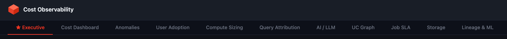

| Tab | Key metrics |
|---|---|
| **Executive** | Spend KPIs, contract-year AI forecast, savings opportunities, workspace Pareto |
| **Cost Dashboard** | Daily DBU/cost by product, cost spike drilldown, tag-based attribution |
| **Anomalies** | Isolation Forest ML scoring, idle resources, cost drift alerts, config rule violations |
| **User Adoption** | DAU trend, service usage donut, inactive user (licence waste) identification |
| **Compute Sizing** | Cluster/warehouse right-sizing, DBR version sprawl, auto-termination flags, 30/60/90d cost |
| **Query Attribution** | Per-user cost, data scanned, slow/failed queries, warehouse utilisation |
| **AI / LLM** | AI Gateway token usage, model comparison (GPT-4, Claude, Mixtral, LLaMA, DBRX) |
| **UC Graph** | Interactive permission graph — 216 nodes, 1,264 edges, privilege filtering |
| **Job SLA** | Job success rates, failure trends, DLT pipeline runs, task bottlenecks |
| **Storage** | Predictive OPTIMIZE/ZORDER/VACUUM health, table inventory, workspace inventory |
| **Lineage & ML** | Data lineage (bronze→silver→gold), model serving endpoints, MLflow, model registry |

---

## Screenshots

### Executive Summary
Spend KPIs, 30-day trend with 7-day forecast, active users, workspace Pareto, and actionable savings opportunities.

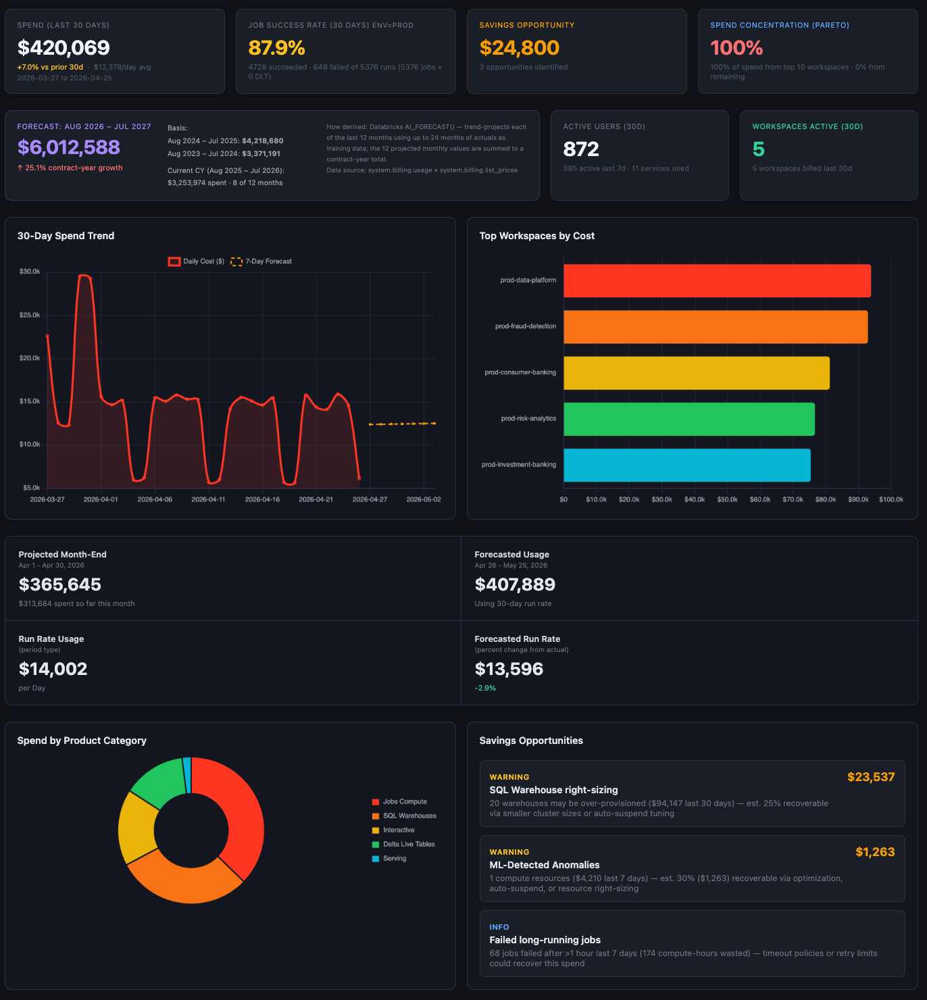

### UC Graph — Unity Catalog Permissions
Interactive force-directed graph showing users, groups, service principals, catalogs, schemas, and privilege edges — filterable by node type and privilege level.

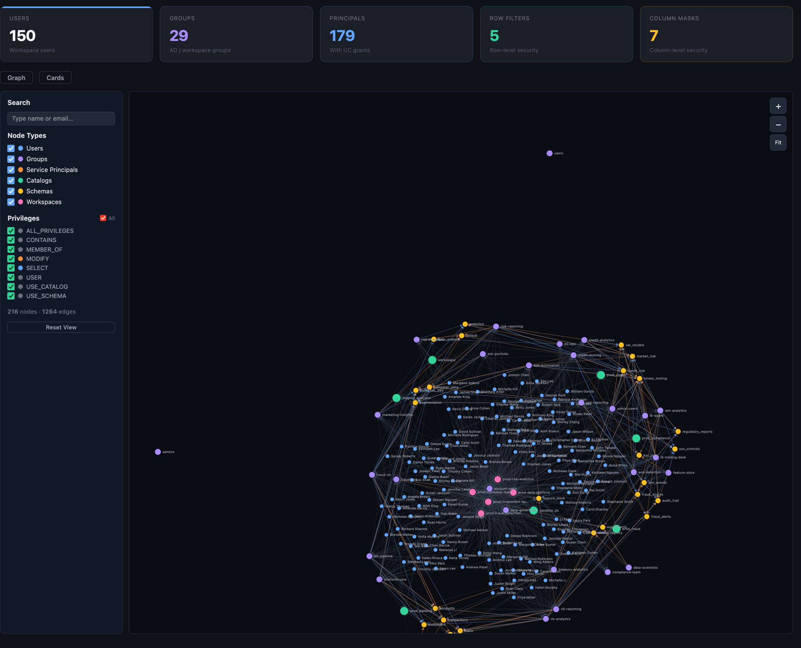

### Anomaly Detection
ML anomaly scores (Isolation Forest + Config Rules), cost drift alerts, and idle resource detection — sorted by ML score with estimated cost impact.

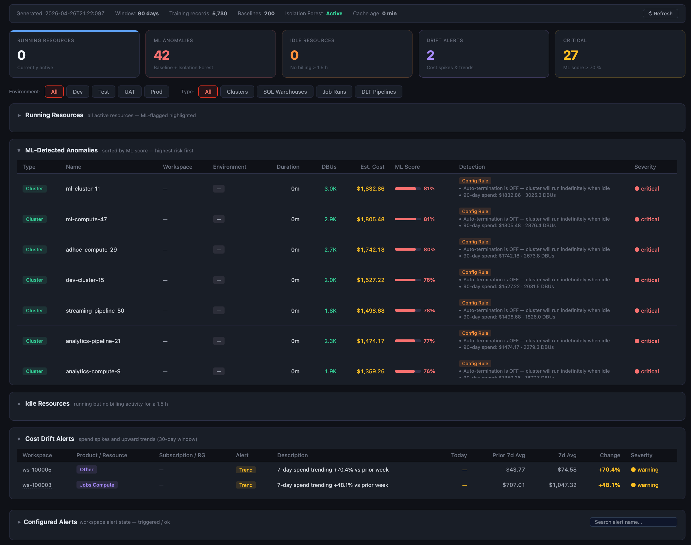

### Compute Sizing
Per-cluster 30/60/90-day DBU and cost, auto-termination flags, DBR version distribution, warehouse size distribution, and utilisation metrics.

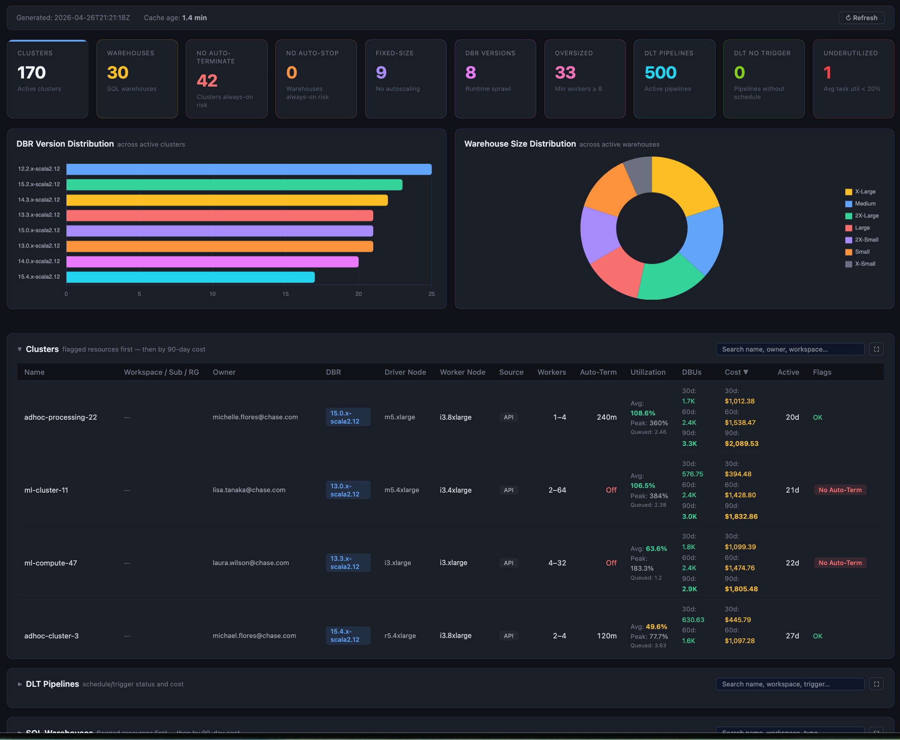

### Query Attribution
Per-user cost attribution with 30/60/90-day breakdown of queries, GB scanned, and estimated cost. Top expensive queries and warehouse-level utilisation.

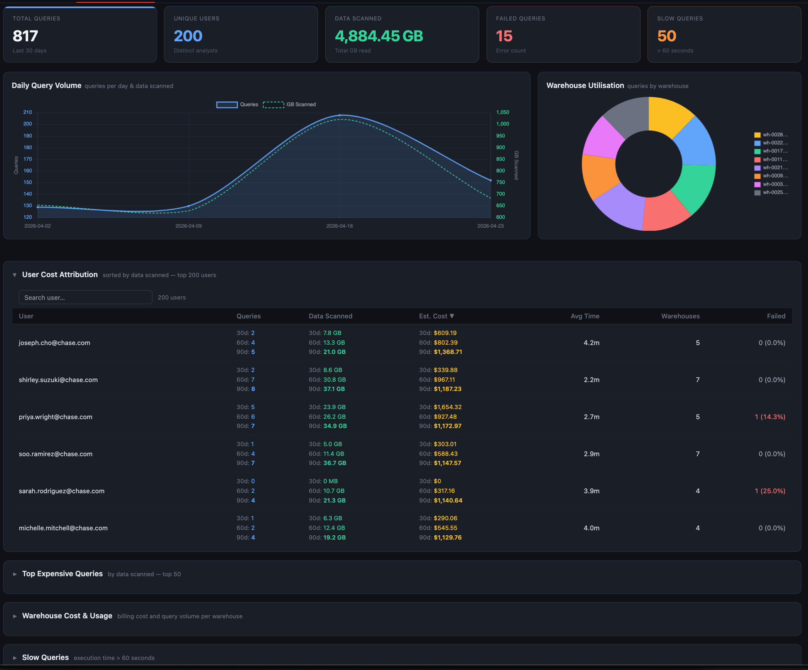

### AI / LLM Usage
AI Gateway request volume, 81M+ tokens consumed, per-model token share, and per-user consumption with input/output breakdown and avg latency.

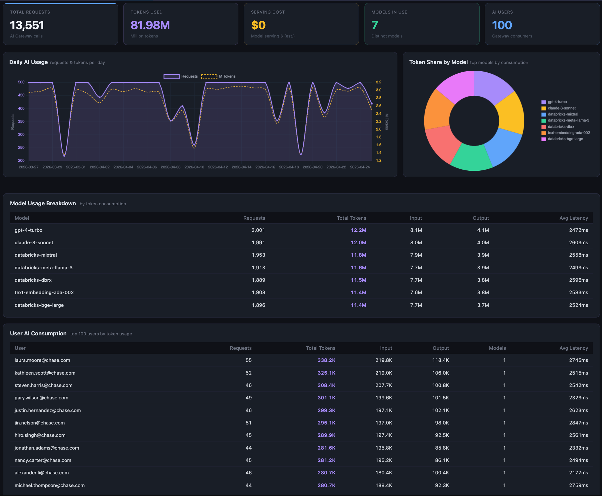

### Job SLA
500 jobs, 5,820 runs, 88% success rate, per-job SLA % with failure counts, avg/max duration, and DLT pipeline health.

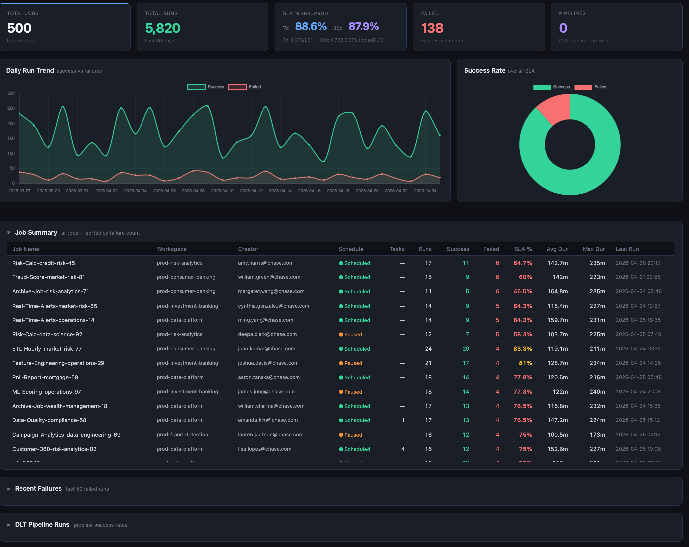

### User Adoption
Daily active users over 90 days, service usage donut across 11 Databricks services, and inactive user table (licence reclamation candidates).

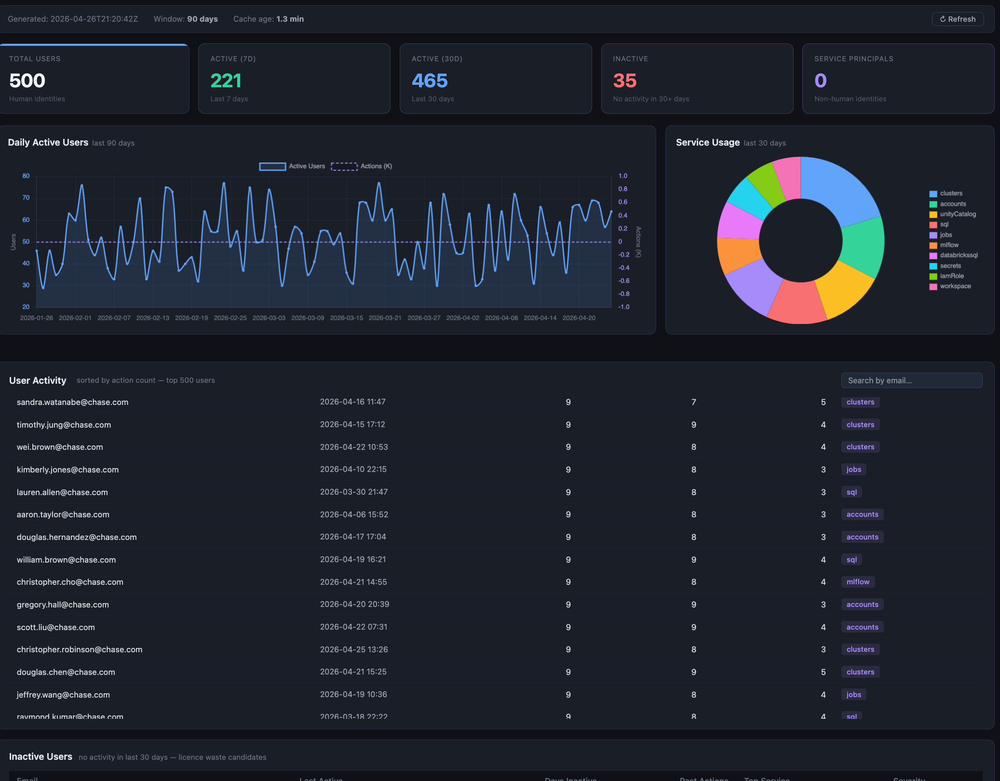

### Cost Dashboard
Daily DBU and cost stacked by product category (Jobs Compute, SQL Warehouse, Interactive, DLT, Serving) with donut share and spike drilldown.

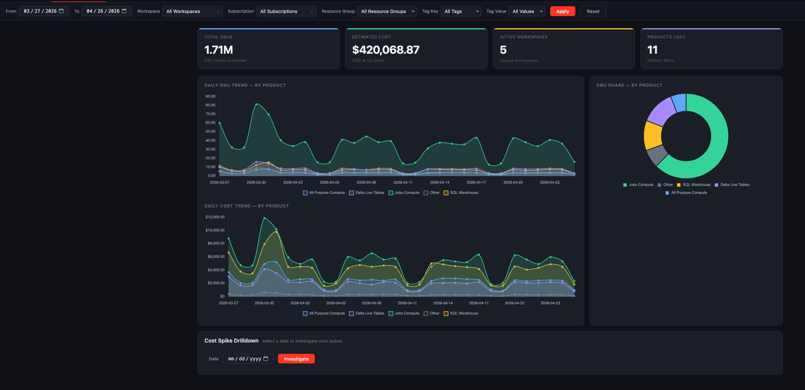

### Storage
Catalog/schema/table inventory, predictive optimization operation health (OPTIMIZE/ZORDER/VACUUM), and workspace inventory with cloud, region, and status.

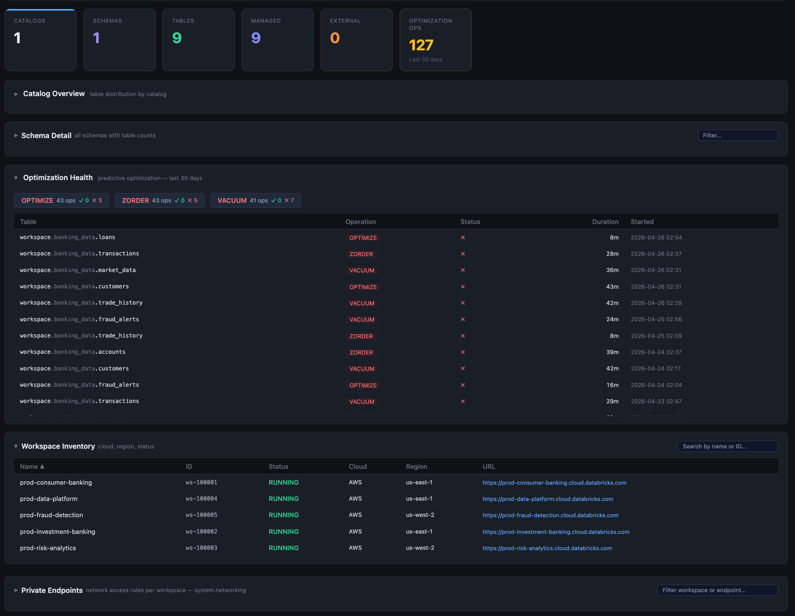

### Lineage & ML
Table-to-table lineage (bronze→silver→gold medallion), 16 model serving endpoints with request/error/latency, MLflow experiments, and model registry.

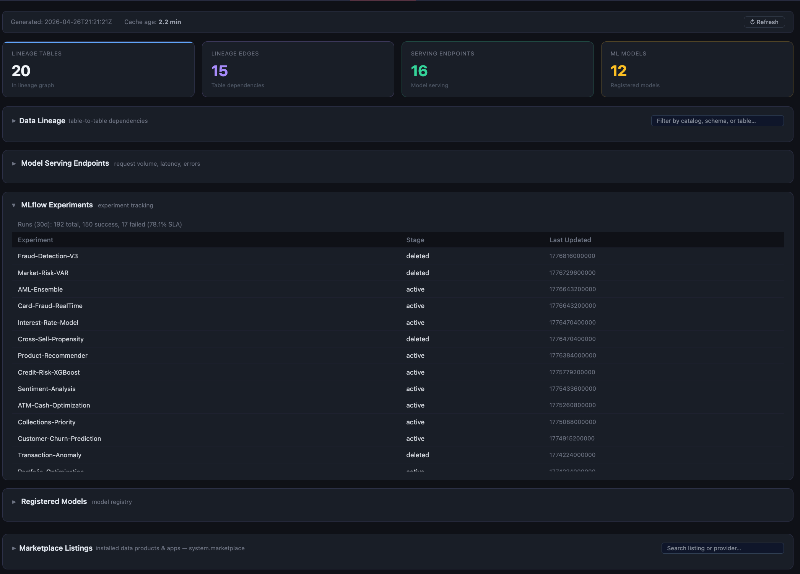

---

## Architecture

```
GitHub Actions  (push to main or workflow_dispatch)
    └── databricks bundle deploy --target dev|prod   # provisions DAB
    └── databricks apps deploy                        # deploys source code

Databricks App  (FastAPI + uvicorn)
    ├── app.py                  # entry point, middleware stack
    ├── api/v1/                 # one FastAPI router per tab
    ├── services/               # SQL query + analysis logic per domain
    └── core/
        ├── sql_executor.py     # async SQL executor + MOCK_MODE rewriter
        ├── security.py         # CSP, rate limiting, audit logging, headers
        ├── validators.py       # strict input validation for all user input
        ├── dependencies.py     # WorkspaceClient DI + admin guard
        └── config.py           # Pydantic settings from app.yaml env vars

static/index.html               # single-page frontend (Chart.js + vanilla JS)
```

Identity is resolved from the `X-Forwarded-User` header injected by the Databricks Apps reverse proxy — no passwords or JWTs required.

---

## Quick Start

### Prerequisites

- Databricks workspace (any tier — free tier works with MOCK_MODE)
- [Databricks CLI](https://docs.databricks.com/en/dev-tools/cli/install.html) installed
- GitHub account

### 1. Fork and clone

```bash
git clone https://github.com/<your-username>/databricks-cost-observability.git
cd databricks-cost-observability
```

### 2. Set four GitHub Secrets

Go to your repo → **Settings → Secrets and variables → Actions → New repository secret**:

| Secret | Where to find it |
|---|---|
| `DATABRICKS_HOST` | Your workspace URL — e.g. `https://adb-1234567890.12.azuredatabricks.net` |
| `DATABRICKS_TOKEN` | **User Settings → Developer → Access tokens → Generate new token** |
| `DATABRICKS_WAREHOUSE_ID` | **SQL → Warehouses → your warehouse → Connection details** |
| `ADMIN_USERS` | Comma-separated admin emails — e.g. `you@company.com` |

Or set them via CLI:

```bash
gh secret set DATABRICKS_HOST
gh secret set DATABRICKS_TOKEN
gh secret set DATABRICKS_WAREHOUSE_ID
gh secret set ADMIN_USERS
```

### 3. Deploy

Push to `main` — GitHub Actions deploys automatically:

```bash
git push origin main
```

Or trigger manually from **Actions → Deploy to Databricks → Run workflow** and choose target:
- `dev` — MOCK_MODE on, uses mock system tables (works on any workspace)
- `prod` — MOCK_MODE off, hits real `system.*` tables (requires system table enablement)

The app URL appears in the Actions log and in **Compute → Apps** in your workspace.

---

## MOCK_MODE

Free-tier workspaces don't have access to `system.billing`, `system.compute`, etc. MOCK_MODE solves this transparently — no code changes needed:

```
MOCK_MODE=true   →  system.billing.usage   becomes   workspace.mock_system_billing.usage
MOCK_MODE=false  →  queries hit real system tables
```

- All 14 system schemas are rewritten at query execution time via regex in `core/sql_executor.py`
- Mock tables are pre-seeded with realistic enterprise sample data (banking domain, 90-day history)
- Switch via GitHub Actions: `dev` target = mock, `prod` target = real

To enable real system tables on a paid workspace, see [Databricks system table docs](https://docs.databricks.com/en/admin/system-tables/index.html).

---

## Local Development

```bash
pip install -r requirements.txt

export DATABRICKS_HOST=https://your-workspace.azuredatabricks.net
export DATABRICKS_TOKEN=dapi...
export DATABRICKS_WAREHOUSE_ID=your-warehouse-id
export MOCK_MODE=true

uvicorn app:app --reload --port 8000
```

Open [http://localhost:8000](http://localhost:8000).

---

## Access Control

| Setting | Purpose |
|---|---|
| `ADMIN_USERS` | Comma-separated emails with full access and Admin panel visibility |
| `ALLOWED_USERS` | Leave empty to allow all workspace-authenticated users |

Per-user tab restrictions, workspace locks, and tag filters can be managed from the **Admin panel** inside the app — no redeploy required.

---

## Security

- **Authentication** — Databricks Apps reverse proxy injects `X-Forwarded-User`; no credentials handled by the app
- **CSP** — `frame-ancestors 'none'`, `object-src 'none'`, `connect-src 'self'`
- **Rate limiting** — tiered sliding-window limits across auth, heavy, API, and static tiers
- **Input validation** — all user input strictly validated before SQL construction (`core/validators.py`)
- **Admin guard** — `require_admin()` on all admin endpoints; 403 on non-admin access with audit log entry
- **No secrets in code** — all credentials flow via GitHub Secrets → bundle variables → app env vars

---

## Project Structure

```
.
├── app.py                              # FastAPI entry point + middleware stack
├── app.yaml                            # Databricks App config (env vars, command)
├── databricks.yml                      # Databricks Asset Bundle (DAB) config
├── requirements.txt
├── api/v1/                             # One FastAPI router per tab
├── services/                           # SQL + analysis logic per domain
├── core/
│   ├── sql_executor.py                 # Async SQL executor + MOCK_MODE rewriter
│   ├── security.py                     # Middleware: CSP, rate limiting, audit log
│   ├── validators.py                   # Input validation (dates, emails, SQL identifiers)
│   ├── dependencies.py                 # WorkspaceClient DI + require_admin()
│   └── config.py                       # Pydantic settings
├── scripts/
│   ├── setup_mock_tables.py            # Creates and seeds mock system tables
│   └── setup_enterprise_mock_data.py  # Optional: 3-year enterprise dataset
├── static/index.html                   # Single-page frontend (Chart.js)
├── .github/workflows/deploy.yml        # CI/CD pipeline
├── CONTRIBUTING.md                     # Contribution guide
└── ROADMAP.md                          # Planned features
```

---

## Contributing

Contributions are welcome — bug fixes, new dashboard tabs, mock data improvements, and cloud-specific fixes.

See [CONTRIBUTING.md](CONTRIBUTING.md) for the fork → PR workflow and [ROADMAP.md](ROADMAP.md) for planned features.

- [Report a bug](../../issues/new?template=bug_report.yml)
- [Request a feature](../../issues/new?template=feature_request.yml)
- [Propose a new tab](../../issues/new?template=new_tab.yml)

---

## License

Licensed under the [Elastic License 2.0](LICENSE).

You may use and deploy this internally within your organisation. You may not offer it as a hosted or managed service to third parties or redistribute it independently. See [LICENSE](LICENSE) for full terms.
